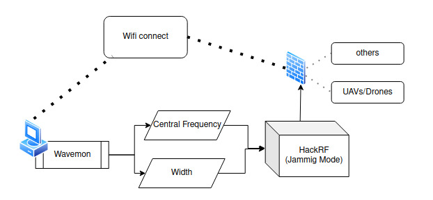

[](https://classroom.github.com/a/H1QdPKuv)
[](https://classroom.github.com/online_ide?assignment_repo_id=16985648&assignment_repo_type=AssignmentRepo)
# INF0413 - Processamento Digital de Sinais e Imagens

Equipe:

- *202303329* - CARLOS HENRIQUE
- *202306405* - DANIEL PINHEIRO
- *202303333* - FRANCISCO GANDALA 
- *202303349* - LUCAS ARRUDA
- *202303358* - PEDRO SARAIVA


# Interceptação de Comunicação de Drones com HackRF PortaPack H2+: Análise de Contra-Inteligência com GPS Spoofing e Jamming de Sinais

### Resumo:

Este trabalho examina as possibilidades de interceptação e neutralização de drones atrav es do uso do dispositivo HackRF PortaPack H2+, focando em t ecnicas avançadas
de contra-inteligência como GPS spoofing e jamming de sinais
de controle. Tais métodos permitem explorar e expor vulnerabilidades presentes em drones, especialmente em contextos onde a
segurança e a privacidade são comprometidas por atividades não
autorizadas. Por meio de experimentos controlados, este estudo
avalia a eficácia das técnicas de spoofing e jamming no desvio
ou interrupção dos sinais de navegação, contribuindo para a
prevenção de riscos em  ́areas senssíveis.

**Palavras-chave: drone, hackrf, fourier, gps spoofing, jamming**

## Seção I. Introdução e Revisão bibliográfica:

### *A. Problema*

A crescente acessibilidade e versatilidade dos drones comerciais traz benefı́cios significativos para diversas áreas,
porém, também amplia a exposição a potenciais usos mal
intencionados, como vigilância não autorizada, invasão de
privacidade e até mesmo ameaças à segurança pública [4]. Diante
dessa realidade, a interceptação de comunicações de drones
se apresenta como uma medida de segurança crucial, es
pecialmente em zonas sensı́veis. O presente estudo explora
como o HackRF PortaPack H2+ pode ser utilizado como uma
ferramenta para mitigar tais riscos, aplicando técnicas de GPS
spoofing e jamming de sinais de controle. Com isso, busca
se examinar as vulnerabilidades dos sistemas de navegação e
controle de drones, destacando as implicações de segurança
e privacidade no uso civil de radiofrequência para neutralizar
tais dispositivos.

### *B. Literatura*

Diversos estudos têm investigado as vulnerabilidades dos
sistemas de drones e as formas de mitigação de riscos
associados. Tippenhauer et al. [1] analisaram os requisitos
para ataques de GPS spoofing, destacando a facilidade de
implementação dessas técnicas. Humphreys [2] discutiu os
riscos de segurança associados à navegação por satélite em
drones civis. Shuai et al. [3] exploraram métodos de detecção
e prevenção de interferência em drones. Puri [4] apresentou
uma visão geral sobre veı́culos aéreos não tripulados e suas
aplicações. Além disso, Baldini et al. [5] examinaram o uso de
SDRs (Software Defined Radios) para segurança em drones.

### *C. Dataset*

O conjunto de dados utilizado neste estudo inclui sinais
de radiofrequência (RF) capturados de drones comerciais
operando em contextos controlados. As amostras abrangem
frequências de GPS (1.57542 GHz para L1) e sinais de
controle tı́picos utilizados em bandas ISM (2.4 GHz e 5.8
GHz). A coleta de dados foi realizada utilizando o HackRF
PortaPack H2+, permitindo uma análise detalhada dos padrões
de comunicação e dos efeitos das interferências aplicadas.

### *D. Metodos*

Para a execução dos experimentos, foram implementadas
técnicas de GPS spoofing com o objetivo de manipular o
sistema de navegação dos drones, desviando sua rota de
maneira controlada. Paralelamente, utilizou-se o método de
jamming de sinais de controle para bloquear a comunicação
entre o operador e o drone, comprometendo sua capacidade de
resposta. O HackRF PortaPack H2+ serviu como dispositivo
central de interferência, configurado para transmitir sinais
especı́ficos capazes de enganar ou sobrecarregar os receptores
dos drones.

### *E. Avaliação*

A eficácia das técnicas aplicadas foi medida através de
métricas como o tempo de resposta do drone à interferência,
a distância de desvio causada pelo GPS spoofing e a taxa
de sucesso na interrupção dos sinais de controle.

## Seção II. Fundamentação teórica:

A manipulação de sinais de Rádio Frequência (RF) requer um entendimento profundo dos princı́pios de comunicação sem fio e processamento de sinais, além de conhecimento dos princípios de funcionamento e comunicação de drones comerciais.

Os drones comerciais utilizam Rádio Frequência (RF) entre 2.4 GHz e 5.8 GHz para comunicar com a central de controle (controle remoto) e transferir comandos e informações. Também é utilizado o GPS/GNSS para mapeamento da posição geográfica do drone.

Os drones WIFI utilizam uma conexão de rede 2.4 GHz para transmitir comandos e imagens.

O GPS spoofing baseia-se na transmissão de sinais falsos que imitam os sinais legı́timos de satélites GPS, enganando o receptor do drone. Já o jamming de sinais consiste em emitir sinais de interferência na mesma frequência dos sinais de controle, reduzindo a relação sinal-ruı́do e tornando a comunicação ineficaz.

O Jammer Wifi funciona emitindo sinais fortes e caóticos para atrapalhar a comunicação dos dispositivos que utilizam esse sistema de transmissão.

O vídeo [Introdução ao GPS Spoofing e SDR](https://www.youtube.com/watch?v=3NWn5cQM7q4) demonstra visualmente como o spoofing pode ser realizado. Este conceito é explorado no repositório [GPS-SDR-SIM no GitHub](https://github.com/osqzss/gps-sdr-sim), que apresenta um simulador de sinais GPS baseado em SDR. Este simulador permite gerar dados GPS personalizados que podem ser transmitidos por dispositivos como o HackRF PortaPack H2+.

O HackRF PortaPack H2+ é um transceptor SDR capaz de transmitir e receber sinais em uma ampla faixa de frequências (1 MHz a 6 GHz), permitindo a implementação dessas técnicas. O processamento dos sinais coletados e a geração dos sinais de interferência envolvem transformadas de Fourier e modulações especı́ficas, sendo essencial o uso de algoritmos eficientes para garantir a eficácia das operações.

### Recursos Relevantes:
- [Mayhem Firmware no GitHub](https://github.com/portapack-mayhem/mayhem-firmwar): Firmware customizado para o HackRF PortaPack H2+ que amplia suas capacidades.
- [GPS-SDR-SIM no GitHub](https://github.com/osqzss/gps-sdr-sim): Software para gerar arquivos de sinais GPS que podem ser transmitidos pelo HackRF.
- [PothosSDR](https://downloads.myriadrf.org/builds/PothosSDR/): Software que permite transmitir arquivos do computador para o HackRF PortaPack.
- [Dados GNSS da NASA](https://cddis.nasa.gov/archive/gnss/data/daily/2024/brdc/): Repositório com arquivos de dados geo-espaciais gerados pela NASA, úteis para gerar sinais GPS precisos.
- Vídeos explicativos:
  - [Vídeo 1: Introdução ao GPS Spoofing e SDR](https://www.youtube.com/watch?v=n-icyyWVHTU)
  - [Vídeo 2: Spoofing GPS na prática](https://www.youtube.com/watch?v=3NWn5cQM7q4)
  - [Vídeo 3: Exemplos adicionais de spoofing](https://www.youtube.com/watch?v=qPhGBFBj4PY)

### Wifi Jamming

1) Instala-se um programa chamado wavemon no computador, e se conecta na rede wifi alvo. Executamos o wavemon para coletar informações caracteristicas da rede, especialmente faixa de frequencia e largura de banda(geralmente 20).
2) No HackRF, conecta-se o amplificador antes da antena e sua respectiva entrada de energia. Na seção de "Transmit" é selecionado "jamming", em jamming vamos em "load frequencies" e selecionamos as frequencias mais proximas das informações coletadas pelo wavemon.
3) Fazemos alguns ajustes, como colocar a frequencia exatoda rede no campo "center" do jammer, e a largura de banda no campo "width". Executa-se o wifi jamming no botão "start".
4) Esperamos a rede cair.

Fluxograma do wifi jamming:



## Seção III. Metodologia:

### GPS Spoofing

1) Preparação do ambiente para fazer o GPS spoffing: para isso
é necessário baixar o firmware do mayhem no HackRF PortaPack H2+,
além disso no computador é necessário baixar o PhotosSDR e o gps-sdr-
sim, e por fim os dados geo-espaciais disponibilizados pela Nasa.

2) Após a preparação do ambiente, é necessario executar o gps-sdr-sim
passando para ele a latitudade e a longitude do local para onde você deseja
"desviar" a localização do gps e os dados geo-espaciais disponibilizados pela
Nasa no dia. Após isso será gerado um arquivo chamado gpssim.bin.

3) Por fim, é necessário conectar o dispositivo HackRF PortaPack H2+ no computador
via USB e ativar no dispositivo o modo HackRF. Após isso, no computador através do 
PhotosSDR é necessário executar o hackrf_transfer passando o arquivo gpssim.bin. Feito
isso, o dispositivo passará emitir ondas com a localização escolhida e qualquer dispositivo
GPS que esteja no alcance da antena será afetado por essas ondas tendo sua localização modificada.

Na imagem abaixo pode-se observar o fluxo utilizado para a realização do GPS Spoofing.


### Wifi Jamming

Foi utilizado um drone wifi tello como obejto de teste. Para obter informações da rede wifi do drone, utilizou-se
programas para realizar a análise da rede wifi, como: wavemon (linux), Wifi Analyser (android). 
O HackRF é conectado no amplificador e, em seguida, a antena de transmissão. Ambos na sua respectiva entrada de energia.

1) Ligar o drone e aguardar que sua rede esteja funcional. Com o aplicativo de preferência, encontrar informações da frequência
de transmissão da rede wifi do drone.

2) No HackRF, navega-se até a seção seção "Transmit", em seguida, é selecionado "jamming", após isso, no campo de "load frequency",
encontra-se o campo de WLAN 2.4 e, por fim, seleciona-se a faixa de frequência mais próxima da obtida, coloca-se a frequência obtida no
centro da transmissão e configura-se a banda.

3) Inicia o Script/Controle do drone, com diferenças de acordo com o experimento.
Após isso, basta iniciar o jamming wifi e ver os resultados.

Fluxo de realização do Wifi Jamming.


## Seção IV. Resultado e Conclusões:

###GPS Spoofing com dispositivos móveis

**Experimento 1**

Após realziar o passo a passo descrito na seção III. Em um dispositivo móvel próximo a antena de transmissão, observa-se a mudança de prosição geográfica do
GPS do dispositivo. 

 **Objetivo**: testar a capacidade e a viabilidade prática do GPS Spoofing.

**Resultado experado**: O dispositivo móvel relatar uma posição geográfica diferente da realidade.

**Quantidade de testes**: 6  
**Quantidade de sucessos**: 4    
**Taxa de sucesso**: 66%

[Link do Vídeo do experimento 1](https://github.com/user-attachments/assets/d982274f-029b-4502-b033-eb32dea755ab) em Apendices:

### Jamming com drone WIFI

Foram realizados dois testes com o mesmo objetivo: comprometer o funcionamento e
a comunicação do drone com o controlador, porém com busca de informações diferentes.
O passo a passo seguido para ambos os testes é descrito na seção III.

**Experimento 2**

Conecta-se um dispositivo de controle na rede wifi do drone, nesse dispositivo é executado o [script_exp1.py](code/script_exp1.py):

```python
  tello.takeoff()

  for i in range(10):
      tello.move_forward(100)
      sleep(2)
      tello.move_left(100)
      sleep(2)
      tello.move_back(100)
      sleep(2)
      tello.move_right(100)
```

**Objetivo**: testar o funcionamento do jamming wifi e sua efetividade prática. 

**Resultado experado**: O drone paralizar e perder conexão com seu controlador.

**Quantidade de testes**: 8    
**Quantidade de sucessos**: 8    
**Taxa de sucesso**: 100%

[Link do Vídeo do experimento 2](https://github.com/user-attachments/assets/3188c650-e0a4-4602-9faf-05b1b073d194) em Apendices: 


**Experimento 3**

Conecta-se um dispositivo de controle na rede wifi do drone, dessa vez o drone
é controlado manualmente por um operador, o qual está a uma distância (aproximada) do HackRF.

**Objetivo**: testar o alcance efetivo para o jamming wifi.

Foram realizados 5 testes:

| Distância (metros) | Resultado                      |
|---------------------|--------------------------------|
| 5                   | Perca total do controle       |
| 10                  | Perca total do controle       |
| 15                  | Perca total do controle       |
| 20                  | Perca parcial do controle     |
| 25                  | Pouca/Nenhuma influência no controle |


[Link do Vídeo do experimento 3](https://github.com/user-attachments/assets/8778b3dc-ce72-46a1-808c-f0a888b8dc92) em Apendices: 

## Referencias:

[1] N. O. Tippenhauer, C. Pöpper, K. B. Rasmussen, and S. Čapkun, “On
the requirements for successful GPS spoofing attacks,” *Proceedings of
the 18th ACM conference on Computer and communications security,*
pp. 75–86, 2011.

[2] T. E. Humphreys, “Statement on the vulnerability of civil unmanned
aerial vehicles and other systems to civil GPS spoofing,” *Subcommittee
on Oversight, Investigations, and Management, US House of Represen-
tatives*, 2012.

[3] J. Shuai, J. Wang, and Y. Wang, “Drone remote control jamming and
anti-jamming techniques: A review,” *IEEE Access*, vol. 6, pp. 19 873–
19 883, 2018.

[4] A. Puri, “A survey of unmanned aerial vehicles (UAV) for traffic surveil-
lance,” *Department of Computer Science and Engineering, University of
South Florida*, 2005.

[5] G. Baldini, R. Garello, and M. Sterbini, “A survey of techniques for
remote control and localization of civilian drones,” *IEEE Aerospace and
Electronic Systems Magazine*, vol. 32, no. 4, pp. 90–103, 2017.

## Apêndices:

- Link do video do experimento 1:  https://github.com/user-attachments/assets/d982274f-029b-4502-b033-eb32dea755ab


- Link do video do experimento 2: https://github.com/user-attachments/assets/3188c650-e0a4-4602-9faf-05b1b073d194


- Link do video do experimento 3: https://github.com/user-attachments/assets/8778b3dc-ce72-46a1-808c-f0a888b8dc92

[def]: method.jpeg
